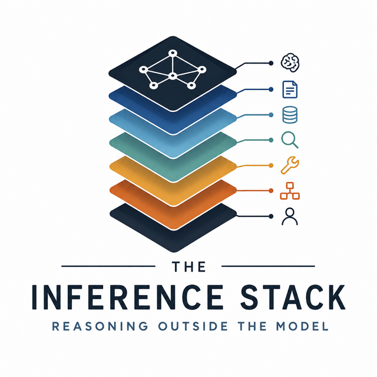

# The Inference Stack

**Reasoning Outside the Model**



A frontier model is a probabilistic calculator over encoded patterns. It is not the
system. This repository is the home of the argument that **the consequential engineering
is no longer inside the weights**, and of the articles, shorts, and framework that
develop it.

Site: **https://inference.thinxai.net**

## The seven layers

| | Layer | What it answers |
|---|---|---|
| L1 | Model | What the weights encode |
| L2 | Context | What the model is given |
| L3 | Memory | What persists across sessions |
| L4 | Retrieval | What grounds a claim in evidence |
| L5 | Tools | What the system can actually do |
| L6 | Orchestration | How calls compose into a system |
| L7 | Governance | Who curates and answers for the result |

Full treatment: [`docs/stack/`](docs/stack/index.md) → https://inference.thinxai.net/stack/

## Repository layout

This repo follows the VWMM convention (see [`00-meta-model/`](00-meta-model/)) with the
published site carried alongside it.

```
docs/                   # Jekyll site → inference.thinxai.net
  articles/             #   long-form articles
  stack/                #   the seven-layer framework
  shorts/               #   short-form video index
  framework/            #   AIDK, HCAE, research programme
  assets/brand/         #   logo lockups, marks, favicons, OG banner
00-meta-model/          # VWMM structural convention
01-strategic-baseline/  # vision, strategy, objectives
02-systems-baseline/    # requirements, architecture, verification
03-solutions-baseline/  # realised solutions
04-construct/           # MxM construct surfaces
05-work-packages/       # tracked work
decisions/              # ADRs
mode.md                 # agent doorway
```

## Provenance

This site supersedes and subsumes **[AI-Research](https://github.com/jdlongmire/AI-Research)**
(aithinkr.net), which remains in place as the historical archive. Articles published
there before 2026-08-23 are carried here and are the versions under active maintenance.

## Authors

**James (JD) Longmire**, Northrop Grumman Fellow, Chief Architect for Digital Ecosystems.
ORCID [0009-0009-1383-7698](https://orcid.org/0009-0009-1383-7698).

**Micah Longmire**, CEO and CTO of Ologos Corp; senior systems and AI architect.
ORCID [0009-0006-7608-9322](https://orcid.org/0009-0006-7608-9322).

Articles carried over from the `AI-Research` archive are single-authored by JD Longmire
and retain their original bylines. Co-authorship applies to The Inference Stack itself:
the framework and the work published under it from 2026-08-23 forward.

## Licence

Content CC BY 4.0. Code MIT.

---

Human-Curated, AI-Enabled (HCAE)
