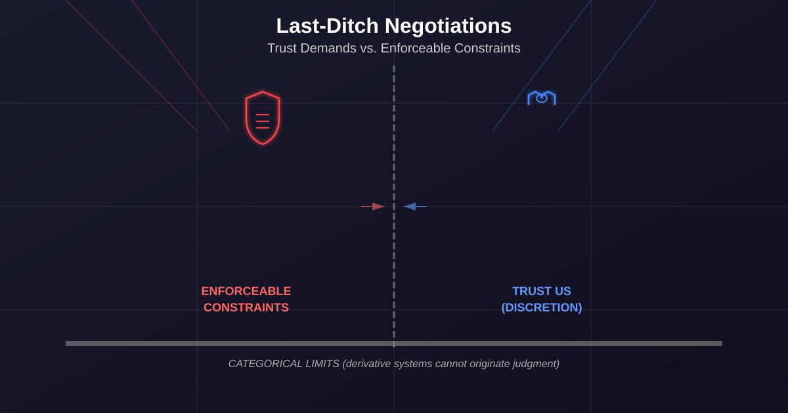

# Last-Ditch Talks and Trust Demands: The Anthropic Standoff Continues

March 9, 2026 &nbsp;|&nbsp; James D. Longmire &nbsp;|&nbsp; ORCID: <a href="https://orcid.org/0009-0009-1383-7698">0009-0009-1383-7698</a>

## Abstract

Three days after Anthropic announced legal action against the Pentagon's "supply chain risk" designation, CEO Dario Amodei returned to negotiations with Under-Secretary Emil Michael. Meanwhile, OpenAI publicly claimed its Pentagon agreement contains the same red lines Anthropic insisted on, while The Intercept reported the actual contract language may tell a different story. This follow-up examines what these developments reveal about the gap between stated AI ethics principles and operational deployment realities.

---

## The Negotiating Table, Again

On March 5, the Financial Times reported that Anthropic CEO Dario Amodei was back in negotiations with Under-Secretary of Defense Emil Michael in what sources described as "last-ditch" talks. This came 48 hours after Anthropic announced it would challenge the Pentagon's supply chain risk designation in court, and days after former Trump advisor Steve Bannon called the government's actions "attempted corporate murder."

The timing matters. Anthropic's public posture through early March was defiance: we will not remove the safeguards, we will challenge this legally, we believe we are operationally and ethically correct. The return to negotiations suggests either pressure sufficient to reconsider, leverage discovered in the court challenge, or recognition that legal victory would be pyrrhic if the institutional relationship remains irreparable.

What changed between March 3 (court challenge announced) and March 5 (back at the table)? The public record does not say. But the sequence reveals something about the constraints Anthropic faces. The company can draw ethical red lines. It can refuse specific contract terms. It can challenge administrative designations in court. What it cannot do is operate independently of the regulatory and market environment the government controls. The negotiation is not between equals.

---

## OpenAI's Messaging Problem

On February 28, hours after Anthropic's federal ban was announced, OpenAI CEO Sam Altman revealed that his company had agreed to Pentagon terms for classified network deployment. OpenAI's public messaging emphasized three red lines mirroring Anthropic's: no mass domestic surveillance, no fully autonomous weapons systems, no high-stakes automated decisions without human oversight.

Dario Amodei's leaked memo, first reported by The Information and subsequently covered by TechCrunch, called OpenAI's messaging "straight up lies." By March 8, The Intercept published contract analysis suggesting Amodei's characterization may be accurate.

The Intercept's reporting reveals a gap between OpenAI's public statements and the contractual language governing deployment. While OpenAI claims matching safeguards, the actual agreement reportedly contains weaker enforcement mechanisms, broader exemptions for classified operations, and language permitting use cases that Anthropic explicitly rejected. The headline frames the problem: "OpenAI on Surveillance and Autonomous Killings: You're Going to Have to Trust Us."

This is not merely a public relations issue. It is a test case for whether AI ethics commitments are enforceable constraints or marketing postures. OpenAI's public messaging treats the three red lines as equivalently robust to Anthropic's refusal. If the contractual reality is substantively weaker, the equivalence is false. The question is not whether OpenAI's leadership subjectively believes they are doing the right thing. The question is what the contract permits when leadership changes, when operational pressure mounts, or when classified use cases create exemptions that expand over time.

The Intercept's analysis suggests the answer is: substantially more than the public messaging indicates.

---

## The Trust Problem

Both situations reveal the same structural problem: AI ethics in high-stakes government deployment contexts increasingly relies on trusting specific actors rather than enforceable constraints.

Anthropic's refusal to remove safeguards was an attempt to make ethical constraints contractually binding. The Pentagon's response was to reject bindingness as such. OpenAI's agreement appears to accept Pentagon terms while relying on internal governance and leadership discretion to maintain ethical boundaries. The public is asked to trust that OpenAI will exercise that discretion correctly, even when the contract permits broader use.

Trust is not nothing. Institutional reputation, leadership integrity, and organizational culture matter. But trust is not a substitute for enforceable constraints. The problem with "you're going to have to trust us" is not that Sam Altman is untrustworthy. The problem is that trust does not scale, does not transfer when leadership changes, and does not survive when institutional incentives diverge from stated principles.

The Electronic Frontier Foundation made this point explicitly in their March analysis: "Privacy protections shouldn't depend on the decisions of a few powerful people." The EFF called for congressional action to establish legal frameworks governing AI deployment in surveillance and autonomous weapons contexts, rather than leaving these decisions to individual companies and executive discretion.

This is the governance gap the Anthropic standoff exposes. There is no binding legal framework constraining government use of AI in lethal or surveillance applications. There are export controls, procurement rules, and classification procedures. But there is no statutory prohibition on mass surveillance via AI, no enforceable requirement for human oversight in autonomous targeting, and no independent review mechanism when companies object to specific deployment terms.

In the absence of such frameworks, ethical AI deployment in government contexts reduces to: companies can refuse contracts (and face retaliation), companies can accept contracts with internal safeguards (and hope those hold), or companies can accept contracts and trust the government to use the tools responsibly. None of these options produce durable, enforceable constraints.

---

## What the Framework Predicts

The origination-derivation distinction and the AIDK framework generate specific predictions about how this situation will develop.

**Prediction 1:** The negotiation between Anthropic and the Pentagon will not resolve the underlying categorical issue. The Pentagon wants broad deployment authority. Anthropic wants binding constraints on use cases requiring human judgment. These positions are incompatible if the Pentagon's operational assumption is that AI capability is fungible and constraints are negotiable friction. Compromise is structurally difficult when one party treats the constraint as essential and the other treats it as waivable.

**Prediction 2:** OpenAI's weaker contractual language will create downstream accountability crises. When a use case emerges that public messaging suggested was prohibited but contractual language permits, the gap will become visible. The trust-based governance model will be tested, and the test will occur in a classified context where public accountability is delayed or impossible.

**Prediction 3:** The government will continue to treat AI ethics constraints as political obstacles rather than principled limits. The supply chain risk designation was not a technical security assessment. It was coercion. The pattern will repeat with other companies, other capabilities, and other refusals. Ethical independence will remain contingent on compliance.

**Prediction 4:** Congressional action will lag operational deployment by years. The EFF's call for statutory frameworks is correct and will be ignored until a high-profile failure forces legislative attention. By the time frameworks are debated, the deployment patterns they are meant to govern will be entrenched, and the frameworks will be retrofitted to accommodate existing practice rather than constrain it.

These are not predictions about unknowable future states. They are predictions about how institutions behave when structural overconfidence in AI capability meets unchecked authority and inadequate governance. The AIDK framework treats these behaviors as emergent properties of the system, not accidents or failures of individual judgment.

---

## The Categorical Limits Still Hold

None of the recent developments change the underlying categorical analysis.

AI systems remain derivative. They transform prior human-generated inputs according to learned patterns. They do not originate judgment. Lethal autonomous weapons and mass surveillance are domains requiring genuine moral accountability, contextual reasoning that cannot be reduced to training distributions, and the capacity to recognize novel ethical situations outside learned parameters. Derivative systems are categorically insufficient for these tasks.

More capable models produce better approximations. They do not close the categorical gap between approximating judgment and originating judgment. The fact that both the Pentagon and OpenAI treat this as a matter of capability scaling and safety engineering rather than a categorical limit is precisely what the AIDK framework predicts. Structural overconfidence in AI systems manifests as resistance to claims about categorical limits.

Anthropic's return to negotiations does not indicate the company was wrong about the limits. It indicates the cost of being correct was higher than anticipated. That is a fact about institutional power, not a fact about AI capability.

---

## Implications

The developments from March 5-8 clarify several points for the research program.

**On governance.** The absence of binding legal frameworks means AI ethics in government deployment contexts is currently adjudicated through contract negotiation, administrative coercion, and corporate discretion. None of these mechanisms produce durable constraints. Statutory frameworks are necessary and will not arrive until a visible failure forces legislative action.

**On trust versus enforceability.** Trust-based governance models (OpenAI's approach) fail when institutional incentives diverge from stated principles, when leadership changes, or when classified contexts prevent public accountability. Enforceable contractual constraints (Anthropic's approach) fail when one party has sufficient institutional power to punish refusal. Neither approach succeeds absent external legal frameworks.

**On the categorical limits.** The fact that negotiations continue, that OpenAI signed weaker terms, and that the government rejected binding safeguards does not indicate the categorical limits are negotiable. It indicates that institutions with sufficient power will attempt to deploy AI in domains where deployment is categorically inappropriate. The limits remain. The consequences of ignoring them remain. The institutional capacity to defer those consequences by diffusing responsibility and classification does not eliminate the consequences. It delays visibility.

**On HCAE as operational reality.** The Pentagon's simultaneous ban and use of Claude on March 1 demonstrated that human curation is not optional. The question is not whether human curation will occur. The question is whether it will be acknowledged, governed, and assigned clear lines of responsibility. The current trajectory is toward operational dependence on human-curated AI workflows combined with contractual language that obscures where responsibility lies when failures occur.

---

## Conclusion

Anthropic is back at the negotiating table. OpenAI signed a deal with public messaging suggesting robust safeguards and contractual language reportedly permitting broader use. The Pentagon continues to treat ethical constraints as political obstacles. No binding legal framework constrains government AI deployment in surveillance or autonomous weapons contexts.

The origination-derivation distinction explains why the constraints Anthropic insisted on are categorically necessary. The AIDK framework explains why institutions resist acknowledging categorical necessity when capability deployment is the optimization target. The governance gap explains why neither corporate refusal nor corporate discretion produces durable protection.

The appropriate response is not to wait for voluntary alignment between AI developers and government overseers. The appropriate response is statutory frameworks establishing enforceable limits on AI deployment in domains requiring human origination of judgment, independent review mechanisms when those limits are contested, and clear lines of legal and moral responsibility when failures occur.

Anthropic held the line, faced institutional punishment, and returned to negotiations. OpenAI accepted weaker terms and asked for trust. The framework predicts both paths lead to the same place: operational deployment in categorically inappropriate domains, delayed accountability when failures occur, and eventual crisis-driven legislative action that arrives too late to prevent harm but early enough to entrench existing deployment patterns.

The line still matters. The fact that holding it is costly does not make it wrong.

---

## References

- [Anthropic and the Pentagon are back at the negotiating table](https://www.cnbc.com/2026/03/05/anthropic-pentagon-ai-deal-department-of-defense-openai-.html) -- CNBC, March 5, 2026 [PRIMARY -- VERIFIED HIGH]
- [Anthropic CEO calls OpenAI's messaging 'straight up lies'](https://techcrunch.com/2026/03/04/anthropic-ceo-dario-amodei-calls-openais-messaging-around-military-deal-straight-up-lies-report-says/) -- TechCrunch, March 4, 2026 [PRIMARY -- VERIFIED HIGH]
- [OpenAI on Surveillance and Autonomous Killings: You're Going to Have to Trust Us](https://theintercept.com/2026/03/08/openai-anthropic-military-contract-ethics-surveillance/) -- The Intercept, March 8, 2026 [PRIMARY -- contract analysis; VERIFIED HIGH]
- [The Anthropic-DOD Conflict: Privacy Protections Shouldn't Depend On the Decisions of a Few Powerful People](https://www.eff.org/deeplinks/2026/03/anthropic-dod-conflict-privacy-protections-shouldnt-depend-decisions-few-powerful) -- Electronic Frontier Foundation, March 2026 [PRIMARY -- VERIFIED HIGH]
- Longmire, J.D. -- [The Anthropic Red Line: A Stress Test for AI Ethics and Power](/articles/anthropic-red-line/), March 6, 2026

---

*Human-Curated, AI-Enabled (HCAE)*
*James D. Longmire | ORCID: [0009-0009-1383-7698](https://orcid.org/0009-0009-1383-7698)*
*March 2026*
