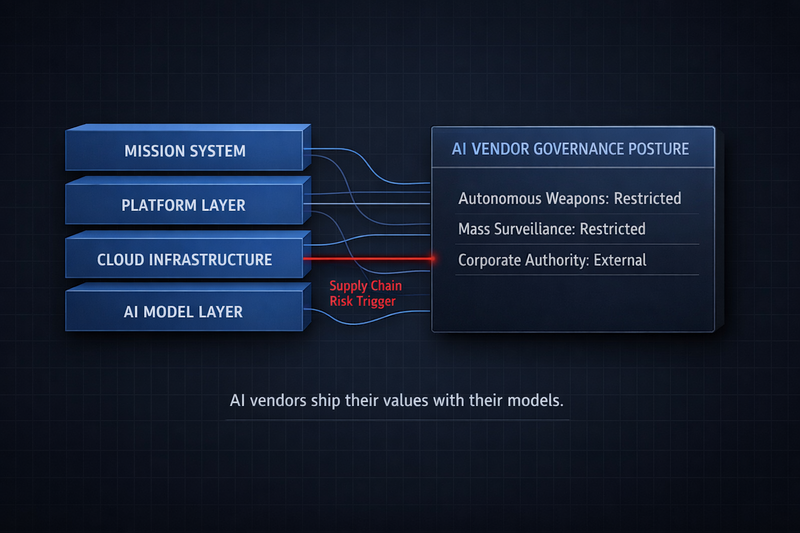

> Every question the defense ecosystem is now scrambling to answer is a question that should have been asked before the contracts were signed.

In a companion piece, I wrote about the blast radius of the Anthropic supply chain risk designation: who's exposed, how deep the entanglement runs, and what comes next. That piece answered "what do you do now?"

This one answers the harder question: why are you in this position?

---

The answer is embarrassingly simple. Nobody treated AI vendor selection as a governance decision.

When a defense program evaluates an AI vendor, the checklist is familiar. Does the model perform? Is it accredited? Can we integrate it? What does it cost? These are fine questions. They're also the only questions most programs asked. And for Claude, the answers were yes across the board.

What nobody asked: What are this vendor's stated constraints on use? Under what conditions will they refuse to serve? Are those constraints in the contract, baked into the model, or both? What happens to our programs when those conditions trigger? How do we get this vendor out of our stack if we have to?

These aren't exotic considerations. Defense acquisition has decades of practice evaluating whether a supplier's corporate structure, foreign ownership, or financial stability creates risk. Nobody would deploy a critical weapons subsystem from a supplier without understanding the conditions under which that supplier might stop delivering. AI got a pass on this discipline, and the Anthropic crisis is the invoice.

---

Anthropic's red lines on surveillance and autonomous weapons were not secret. They were publicly stated corporate commitments. The Pentagon's requirement for "all lawful purposes" access was not secret either. These two positions were in visible tension before a single line of code reached a classified network.

The contracting process didn't force the comparison. Vendor agreements for AI services typically cover licensing, service levels, data handling, liability, and acceptable use. What they rarely address is what the vendor *won't* do, what triggers a refusal, and what happens to the customer when a refusal occurs. For traditional software, this doesn't matter much. The software does what the specification says. For AI systems with embedded governance commitments, the vendor's values are an architectural property of the product. They ship with the model. You don't get to negotiate them out after deployment.

---

The fix isn't complicated. Before you sign the next AI vendor agreement, ask six questions:

*Governance posture.* What are the vendor's constraints on use, and who has authority to change them?

*Purpose alignment.* Does the vendor's intended use for the technology match your requirements? Where are the conflicts?

*Supply chain visibility.* Can you trace every AI component in your stack to its origin vendor, including what's embedded in platforms and subcontractor toolchains?

*Financial entanglement.* What equity stakes, partnerships, and co-developed infrastructure tie your platform vendor to your model vendor? The AWS-Anthropic relationship is an &#36;8 billion object lesson in why this matters.

*Disentanglement planning.* What does it cost to remove this vendor? How long does it take? What degrades? Require this analysis before deployment, not during a crisis.

*Model portability.* Does your architecture allow model substitution without rework? If the answer is no, you've built a structural dependency on a vendor whose governance posture you may not control.

None of this is new thinking. It's supply chain risk management. The only thing new is applying it to AI.

---

The structural tension that produced the Anthropic crisis is permanent. OpenAI has stated it shares the same red lines. Worker groups across Amazon, Google, and Microsoft have demanded limits on military AI use. The next collision will involve a different vendor and a different constraint. The underlying conflict over who sets the purpose of powerful AI models will be the same.

The organizations that avoid the next version of this crisis will be the ones that asked the governance questions before they signed. The ones that treated AI vendors as governance decisions, not procurement decisions. The ones that didn't wait for a supply chain risk designation to discover what their vendor wouldn't do.

> AI vendors ship their values with their models. If you don't know what those values are before you deploy, you'll find out when they conflict with yours.
